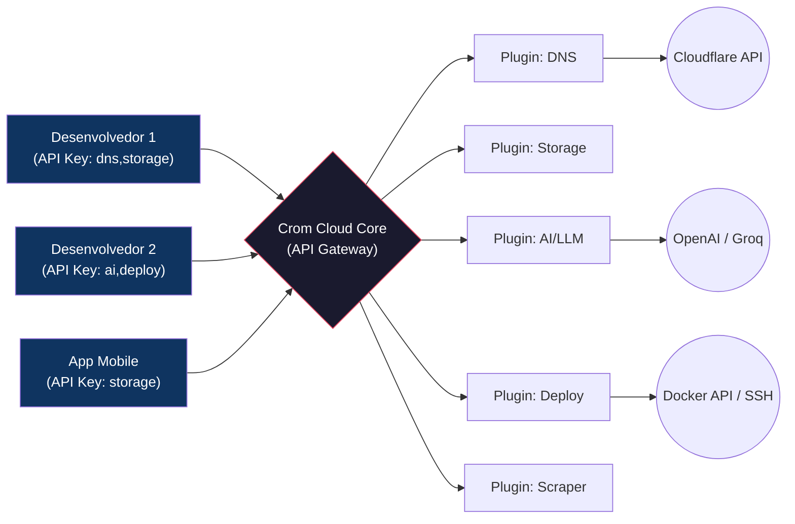

# Crom Cloud — Visão Geral do Produto

> **Última atualização:** 2026-05-05
> **Status:** Em desenvolvimento ativo

---

## O que é o Crom Cloud?

O **Crom Cloud** é uma plataforma SaaS que expõe ferramentas e serviços diversos através de uma **API única e centralizada**, inspirada no modelo do [OpenRouter](https://openrouter.ai) (que unifica LLMs sob uma única API), mas aplicada a **qualquer tipo de ferramenta/serviço**.

### Analogia Simples

| OpenRouter | Crom Cloud |
|------------|------------|
| Unifica LLMs (OpenAI, Anthropic, Groq...) | Unifica **ferramentas** (DNS, Storage, AI, Deploy, Scraper...) |
| Uma API Key → acessa qualquer modelo | Uma API Key → acessa qualquer ferramenta habilitada |
| Cobra por tokens consumidos | Cobra por **créditos** consumidos |
| Desenvolvedor escolhe o modelo na hora | Desenvolvedor escolhe a **ferramenta** na hora |

---

## Como Funciona para o Desenvolvedor-Cliente?

```text
1. Cria uma conta no Crom Cloud
2. Compra créditos (Stripe / PIX / Cripto)
3. Cadastra seus tokens externos no Cofre (ex: API Key da AWS, Cloudflare, OpenAI)
4. Gera N API Keys, cada uma com permissões específicas:
   - Key A → acessa DNS + Storage (para o backend)
   - Key B → acessa só Storage em modo leitura (para o mobile)
   - Key C → acessa AI + Deploy (para o worker)
5. Faz requisições HTTP para: api.cromcloud.com/v1/{ferramenta}/{ação}
6. Cada chamada consome créditos da conta. Ferramentas diferentes = custos diferentes.
```

---

## Diagrama: Visão Macro da Plataforma



---

## Proposta de Valor

| Para quem? | Benefício |
|------------|-----------|
| **Desenvolvedor que consome** | Uma única integração, uma única API Key, um único billing. Não precisa integrar 10 SDKs diferentes. |
| **Equipe CROM (que mantém)** | Adicionar nova ferramenta = criar uma pasta com um binário. Sem tocar no Core. |
| **Futuro** | Abrir a plataforma para desenvolvedores externos criarem plugins e monetizarem. Marketplace. |

---

## Princípios Fundadores

1. **API-First:** Tudo que o Dashboard faz, a API também faz. O Dashboard é apenas um cliente da própria API.
2. **Plugin-Oriented:** O Core não conhece a lógica de nenhuma ferramenta. Ele é um roteador inteligente.
3. **Multi-Linguagem:** Go é a base obrigatória (wrapper gRPC), mas a lógica real pode ser Python, Node, Rust, Bash ou qualquer coisa.
4. **Créditos Unificados:** Uma única carteira de créditos para todas as ferramentas. Cada ferramenta define seu custo no `manifest.json`.
5. **Segurança por Isolamento:** Cada plugin roda como processo separado. Tokens externos ficam no cofre do Core, nunca no plugin.

---

## Documentos Relacionados

| Documento | Descrição |
|-----------|-----------|
| [01-architecture.md](./01-architecture.md) | Arquitetura técnica detalhada (Core + Plugins) |
| [02-database-schema.md](./02-database-schema.md) | Modelagem de dados e diagrama ER |
| [03-api-reference.md](./03-api-reference.md) | Referência completa da API pública |
| [04-plugin-development-guide.md](./04-plugin-development-guide.md) | Guia para criar novos plugins |
| [05-credit-system.md](./05-credit-system.md) | Sistema de créditos e billing |
| [06-security.md](./06-security.md) | Segurança, cofre de secrets e isolamento |
| [07-project-structure.md](./07-project-structure.md) | Estrutura de arquivos e pastas |
| [08-roadmap.md](./08-roadmap.md) | Checklist de execução e fases |
