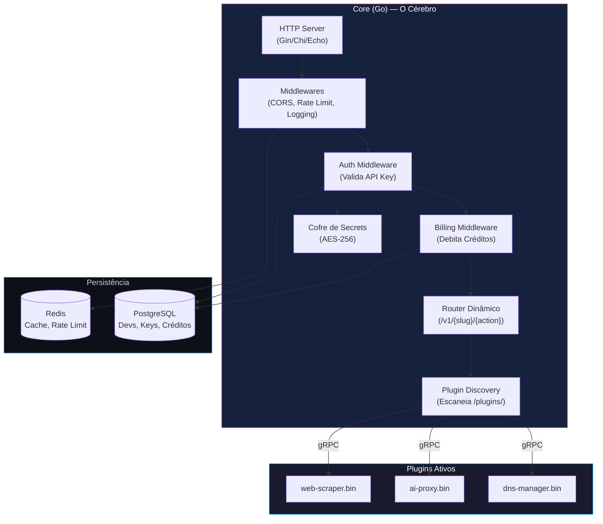
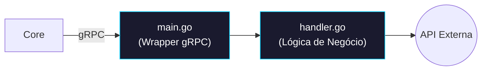
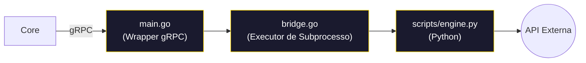
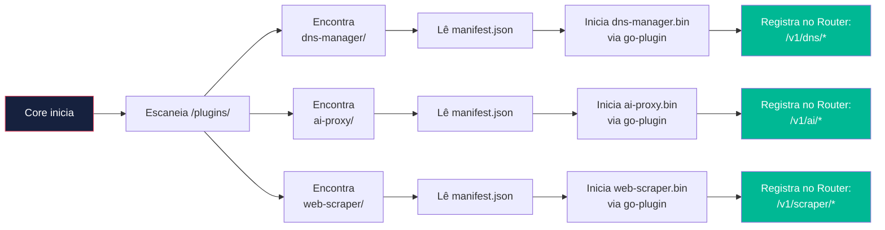

# Arquitetura Técnica — Core + Plugins Multi-Linguagem

> **Padrão Arquitetural:** Microkernel (Core + Plugins) via gRPC
> **Referências do Mercado:** Terraform, Vault, Grafana (todos usam `hashicorp/go-plugin`)

---

## 1. Princípio Fundamental

O sistema é dividido em duas esferas totalmente desacopladas:

| Componente | Responsabilidade | Linguagem |
|------------|-----------------|-----------|
| **Core** | Autenticação, API Keys, Créditos, Roteamento, Discovery | Go (100%) |
| **Plugin** | Lógica de negócio da ferramenta específica | Go (wrapper obrigatório) + Qualquer linguagem (lógica) |

> **Regra de Ouro:** Para adicionar uma nova ferramenta, você **nunca** precisa alterar o código do Core. Basta criar um plugin na pasta `/plugins/` e o Core o descobre automaticamente.

---

## 2. Diagrama de Componentes do Core



---

## 3. Modelo de Plugin: Go Puro vs Multi-Linguagem

### Plugin 100% Go

Quando a ferramenta é escrita inteiramente em Go, o plugin é um único binário que implementa diretamente a interface gRPC.



**Vantagem:** Performance máxima. Sem overhead de subprocesso.
**Quando usar:** Ferramentas simples de CRUD contra APIs REST externas (DNS, Domains, etc).

---

### Plugin Multi-Linguagem (Go + Python/Node/Bash/etc)

Quando a lógica real é mais natural em outra linguagem (ex: ML em Python, Scraping em Node), o plugin Go atua como **ponte**: recebe a requisição via gRPC e executa um subprocesso na linguagem escolhida.



**Vantagem:** Usa o ecossistema ideal de cada linguagem (numpy, puppeteer, etc).
**Quando usar:** ML/AI (Python), Scraping com headless browser (Node), automação de infra (Bash).

---

## 4. Comunicação Core ↔ Plugin: Contrato gRPC

Todos os plugins implementam a mesma interface definida em `core/proto/plugin.proto`:

```protobuf
syntax = "proto3";
package cromcloud;

option go_package = "github.com/crom/crom-cloud/core/proto";

// Serviço que TODO plugin deve implementar
service CromPlugin {
  // Retorna informações sobre o plugin (lido do manifest)
  rpc GetManifest(Empty) returns (Manifest);

  // Health check
  rpc HealthCheck(Empty) returns (HealthResponse);

  // Executa uma ação do plugin
  rpc ExecuteAction(ActionRequest) returns (ActionResponse);
}

message Empty {}

message Manifest {
  string slug = 1;
  string name = 2;
  string version = 3;
  string description = 4;
  string icon = 5;
  repeated RouteInfo routes = 6;
}

message RouteInfo {
  string method = 1;   // GET, POST, PUT, DELETE
  string path = 2;     // /zones, /generate
  string scope = 3;    // read, write, admin
}

message ActionRequest {
  string action = 1;           // Nome da rota/ação solicitada
  string method = 2;           // HTTP method original
  bytes payload = 3;           // Body da requisição (JSON)
  map<string, string> headers = 4;
  map<string, string> secrets = 5; // Tokens injetados pelo Core (do cofre)
  string developer_id = 6;    // ID do dev autenticado
}

message ActionResponse {
  int32 status_code = 1;       // HTTP status code de resposta
  bytes data = 2;              // JSON de resposta
  string error_message = 3;    // Vazio se sucesso
}

message HealthResponse {
  bool healthy = 1;
  string message = 2;
}
```

---

## 5. Fluxo de Comunicação Multi-Linguagem (Detalhado)

```mermaid
sequenceDiagram
    participant Client as Cliente (HTTP)
    participant Core as Core (Go)
    participant DB as PostgreSQL
    participant Wrapper as Wrapper Go (Plugin)
    participant Script as engine.py (Python)
    participant ExtAPI as API Externa

    Client->>Core: POST /v1/ai/generate<br/>Header: Bearer crom_sk_xxxx

    rect rgb(30, 30, 60)
        Note over Core,DB: Pipeline de Validação no Core
        Core->>DB: 1. Valida API Key (hash lookup)
        DB-->>Core: Key OK, developer_id=uuid-123
        Core->>DB: 2. Verifica permissão: key tem scope "ai:write"?
        DB-->>Core: Permitido
        Core->>DB: 3. Verifica créditos: saldo >= 50?
        DB-->>Core: Saldo: 4900 (OK)
        Core->>DB: 4. Busca secrets: openai_api_key do dev uuid-123
        DB-->>Core: Retorna token descriptografado
        Core->>DB: 5. Debita 50 créditos (transação atômica)
    end

    rect rgb(40, 40, 20)
        Note over Core,Script: Despacho para Plugin via gRPC
        Core->>Wrapper: gRPC ExecuteAction(action="generate", secrets={openai_key: "sk-xxx"})
        Wrapper->>Script: exec: python3 engine.py<br/>stdin: {"action":"generate","payload":{...},"secrets":{...}}
        Script->>ExtAPI: openai.chat.completions.create(...)
        ExtAPI-->>Script: Resposta da OpenAI
        Script-->>Wrapper: stdout: {"status":200,"data":{"text":"..."}}
        Wrapper-->>Core: gRPC ActionResponse
    end

    Core->>DB: 6. Registra no usage_log
    Core-->>Client: HTTP 200 {"success":true,"data":{...},"meta":{"credits_remaining":4850}}
```



---

## 6. Plugin Discovery — Como o Core Encontra os Plugins

Ao iniciar, o Core executa o seguinte processo:

```text
1. Escaneia a pasta /plugins/ procurando subdiretórios
2. Para cada subdiretório, procura um arquivo manifest.json
3. Valida o manifest contra o schema esperado
4. Inicia o binário do plugin como subprocesso
5. Conecta via gRPC e chama GetManifest() para confirmar
6. Registra o plugin no router dinâmico:
   /v1/{manifest.slug}/* → dispatcher → este plugin
7. O dashboard lê GET /v1/system/plugins para montar o menu
```



---

## Documentos Relacionados

- **Anterior:** [00-visao-geral.md](./00-visao-geral.md)
- **Próximo:** [02-database-schema.md](./02-database-schema.md)
