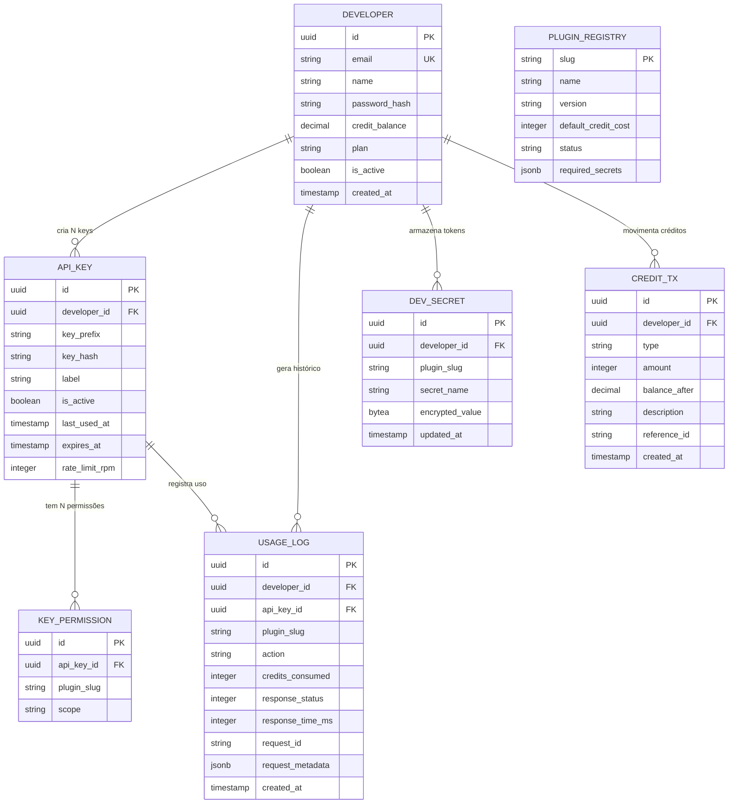

# Modelagem de Dados — Schema do Banco de Dados

> **Banco principal:** PostgreSQL | **Cache:** Redis

---

## 1. Diagrama ER



---

## 2. SQL de Criação (PostgreSQL)

### developers
```sql
CREATE TABLE developers (
    id              UUID PRIMARY KEY DEFAULT gen_random_uuid(),
    email           VARCHAR(255) UNIQUE NOT NULL,
    name            VARCHAR(255) NOT NULL,
    password_hash   VARCHAR(255) NOT NULL,
    credit_balance  DECIMAL(12,2) NOT NULL DEFAULT 0.00,
    plan            VARCHAR(50) NOT NULL DEFAULT 'free',
    is_active       BOOLEAN NOT NULL DEFAULT TRUE,
    created_at      TIMESTAMPTZ NOT NULL DEFAULT NOW(),
    updated_at      TIMESTAMPTZ NOT NULL DEFAULT NOW()
);
CREATE INDEX idx_developers_email ON developers(email);
```

### api_keys
```sql
CREATE TABLE api_keys (
    id              UUID PRIMARY KEY DEFAULT gen_random_uuid(),
    developer_id    UUID NOT NULL REFERENCES developers(id) ON DELETE CASCADE,
    key_prefix      VARCHAR(20) NOT NULL,
    key_hash        VARCHAR(64) NOT NULL,
    label           VARCHAR(255) NOT NULL,
    is_active       BOOLEAN NOT NULL DEFAULT TRUE,
    last_used_at    TIMESTAMPTZ,
    expires_at      TIMESTAMPTZ,
    rate_limit_rpm  INTEGER DEFAULT 60,
    created_at      TIMESTAMPTZ NOT NULL DEFAULT NOW()
);
CREATE INDEX idx_api_keys_hash ON api_keys(key_hash);
CREATE INDEX idx_api_keys_developer ON api_keys(developer_id);
```

### key_permissions
```sql
CREATE TABLE key_permissions (
    id          UUID PRIMARY KEY DEFAULT gen_random_uuid(),
    api_key_id  UUID NOT NULL REFERENCES api_keys(id) ON DELETE CASCADE,
    plugin_slug VARCHAR(100) NOT NULL,
    scope       VARCHAR(20) NOT NULL DEFAULT 'read',
    UNIQUE(api_key_id, plugin_slug)
);
CREATE INDEX idx_key_permissions_key ON key_permissions(api_key_id);
```

### usage_logs
```sql
CREATE TABLE usage_logs (
    id                UUID PRIMARY KEY DEFAULT gen_random_uuid(),
    developer_id      UUID NOT NULL REFERENCES developers(id),
    api_key_id        UUID REFERENCES api_keys(id),
    plugin_slug       VARCHAR(100) NOT NULL,
    action            VARCHAR(255) NOT NULL,
    method            VARCHAR(10) NOT NULL,
    credits_consumed  INTEGER NOT NULL DEFAULT 0,
    response_status   INTEGER NOT NULL,
    response_time_ms  INTEGER NOT NULL,
    request_id        VARCHAR(36) NOT NULL,
    request_metadata  JSONB,
    created_at        TIMESTAMPTZ NOT NULL DEFAULT NOW()
);
CREATE INDEX idx_usage_logs_developer ON usage_logs(developer_id);
CREATE INDEX idx_usage_logs_created ON usage_logs(created_at);
```

### dev_secrets
```sql
CREATE TABLE dev_secrets (
    id              UUID PRIMARY KEY DEFAULT gen_random_uuid(),
    developer_id    UUID NOT NULL REFERENCES developers(id) ON DELETE CASCADE,
    plugin_slug     VARCHAR(100) NOT NULL,
    secret_name     VARCHAR(255) NOT NULL,
    secret_label    VARCHAR(255) NOT NULL,
    encrypted_value BYTEA NOT NULL,
    created_at      TIMESTAMPTZ NOT NULL DEFAULT NOW(),
    updated_at      TIMESTAMPTZ NOT NULL DEFAULT NOW(),
    UNIQUE(developer_id, plugin_slug, secret_name)
);
CREATE INDEX idx_dev_secrets_lookup ON dev_secrets(developer_id, plugin_slug);
```

### credit_transactions
```sql
CREATE TABLE credit_transactions (
    id            UUID PRIMARY KEY DEFAULT gen_random_uuid(),
    developer_id  UUID NOT NULL REFERENCES developers(id),
    type          VARCHAR(20) NOT NULL,
    amount        INTEGER NOT NULL,
    balance_after DECIMAL(12,2) NOT NULL,
    description   TEXT,
    reference_id  VARCHAR(255),
    created_at    TIMESTAMPTZ NOT NULL DEFAULT NOW()
);
CREATE INDEX idx_credit_tx_developer ON credit_transactions(developer_id);
```

### plugin_registry
```sql
CREATE TABLE plugin_registry (
    slug                VARCHAR(100) PRIMARY KEY,
    name                VARCHAR(255) NOT NULL,
    description         TEXT,
    version             VARCHAR(20) NOT NULL,
    icon                VARCHAR(50),
    default_credit_cost INTEGER NOT NULL DEFAULT 1,
    status              VARCHAR(20) NOT NULL DEFAULT 'active',
    required_secrets    JSONB,
    config              JSONB,
    registered_at       TIMESTAMPTZ NOT NULL DEFAULT NOW(),
    updated_at          TIMESTAMPTZ NOT NULL DEFAULT NOW()
);
```

---

## 3. Estratégia de Cache (Redis)

| Chave Redis | TTL | Uso |
|-------------|-----|-----|
| `apikey:{hash}` | 5 min | Cache de validação de API Key |
| `ratelimit:{key_id}:{minute}` | 60s | Rate limiting por key |
| `credits:{dev_id}` | 30s | Cache do saldo |
| `plugin:{slug}:health` | 30s | Status de saúde do plugin |

---

## Documentos Relacionados

- **Anterior:** [01-architecture.md](./01-architecture.md)
- **Próximo:** [03-api-reference.md](./03-api-reference.md)
