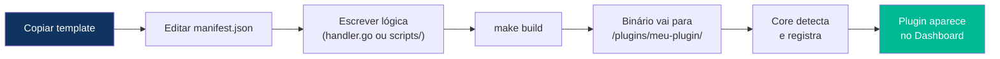

# Guia de Desenvolvimento de Plugins

> **Objetivo:** Criar uma nova ferramenta para o Crom Cloud da maneira mais rápida possível.
> **Tempo estimado:** 15 minutos (usando o template) até o plugin aparecer no dashboard.

---

## 1. Conceito: O que é um Plugin?

Um plugin é um **processo independente** que o Core inicia e se comunica via **gRPC**. Ele é composto por:

| Componente | Obrigatório? | Descrição |
|------------|-------------|-----------|
| `manifest.json` | ✅ Sim | Metadados: nome, slug, rotas, custo, secrets |
| `main.go` | ✅ Sim | Wrapper gRPC que registra o plugin no Core |
| `handler.go` | ✅ Sim | Lógica de negócio (Go puro) |
| `bridge.go` | Apenas multi-lang | Executor de subprocesso para outra linguagem |
| `scripts/` | Apenas multi-lang | Código na linguagem real (Python, Node, etc) |
| `Makefile` | ✅ Sim | Build e deploy automatizado |
| `go.mod` | ✅ Sim | Dependências Go do plugin |

---

## 2. Criando um Plugin (Passo a Passo)

### Método 1: Via Script Automatizado (Recomendado)

```bash
# Plugin 100% Go
./tools/create-plugin.sh meu-plugin

# Plugin Go + Python
./tools/create-plugin.sh meu-plugin --lang=python

# Plugin Go + Node.js
./tools/create-plugin.sh meu-plugin --lang=node

# Plugin Go + Bash
./tools/create-plugin.sh meu-plugin --lang=bash
```

O script:
1. Copia o template adequado para `/plugins/meu-plugin/`
2. Renomeia variáveis de placeholder para `meu-plugin`
3. Inicializa o `go.mod`
4. Cria o `manifest.json` com valores padrão para você editar

### Método 2: Manual (Copiar Template)

```bash
cp -r templates/template-go/ plugins/meu-plugin/
cd plugins/meu-plugin/
# Edite manifest.json, main.go e handler.go
```

---

## 3. O manifest.json (Obrigatório)

Todo plugin deve ter um `manifest.json` na raiz da sua pasta:

```json
{
  "slug": "meu-plugin",
  "name": "Meu Plugin Incrível",
  "version": "1.0.0",
  "description": "Faz algo incrível via API",
  "icon": "rocket",
  "status": "active",

  "runtime": {
    "binary": "./meu-plugin.bin",
    "language": "go",
    "health_check_interval": "30s"
  },

  "billing": {
    "model": "per_call",
    "credit_cost": 5,
    "premium_actions": {
      "heavy_action": 50
    }
  },

  "required_secrets": [
    {
      "key": "external_api_key",
      "label": "Chave da API Externa",
      "required": true
    }
  ],

  "api_routes": [
    {
      "method": "GET",
      "path": "/list",
      "description": "Lista recursos",
      "scope": "read"
    },
    {
      "method": "POST",
      "path": "/create",
      "description": "Cria um recurso",
      "scope": "write"
    }
  ]
}
```

### Campos do manifest.json

| Campo | Tipo | Descrição |
|-------|------|-----------|
| `slug` | string | Identificador único (usado na URL: `/v1/{slug}/...`) |
| `runtime.binary` | string | Caminho do executável Go (relativo à pasta do plugin) |
| `runtime.language` | string | `"go"` para Go puro, `"python"`, `"node"`, `"bash"` para multi-lang |
| `runtime.script_entry` | string | Caminho do script (só para multi-lang) |
| `billing.credit_cost` | int | Custo padrão por chamada |
| `billing.premium_actions` | map | Ações com custo diferenciado |
| `required_secrets` | array | Tokens que o desenvolvedor-cliente precisa cadastrar |
| `api_routes` | array | Rotas expostas (geram endpoints `/v1/{slug}/{path}`) |

---

## 4. Plugin 100% Go (Exemplo Completo)

### handler.go
```go
package main

import (
    "encoding/json"
    "fmt"
    pb "github.com/crom/crom-cloud/core/proto"
)

func HandleAction(req *pb.ActionRequest) *pb.ActionResponse {
    switch req.Action {
    case "list":
        return handleList(req)
    case "create":
        return handleCreate(req)
    default:
        return &pb.ActionResponse{
            StatusCode:   404,
            ErrorMessage: fmt.Sprintf("Ação desconhecida: %s", req.Action),
        }
    }
}

func handleList(req *pb.ActionRequest) *pb.ActionResponse {
    // Acesse o secret injetado pelo Core:
    apiKey := req.Secrets["external_api_key"]

    // Use o token para chamar a API externa
    result := map[string]interface{}{
        "items": []string{"item1", "item2"},
        "total": 2,
    }
    data, _ := json.Marshal(result)

    return &pb.ActionResponse{
        StatusCode: 200,
        Data:       data,
    }
}

func handleCreate(req *pb.ActionRequest) *pb.ActionResponse {
    // Parse o payload recebido
    var input struct {
        Name string `json:"name"`
    }
    json.Unmarshal(req.Payload, &input)

    result := map[string]interface{}{
        "id":      "new-uuid",
        "name":    input.Name,
        "created": true,
    }
    data, _ := json.Marshal(result)

    return &pb.ActionResponse{
        StatusCode: 201,
        Data:       data,
    }
}
```

---

## 5. Plugin Multi-Linguagem (Go + Python)

### bridge.go (Executor de Subprocesso)
```go
package main

import (
    "bytes"
    "encoding/json"
    "fmt"
    "os/exec"
    pb "github.com/crom/crom-cloud/core/proto"
)

func HandleAction(req *pb.ActionRequest) *pb.ActionResponse {
    // Monta o input para o script Python
    input := map[string]interface{}{
        "action":  req.Action,
        "payload": json.RawMessage(req.Payload),
        "secrets": req.Secrets,
    }
    inputJSON, _ := json.Marshal(input)

    // Executa o script Python como subprocesso
    cmd := exec.Command("python3", "./scripts/engine.py")
    cmd.Stdin = bytes.NewReader(inputJSON)

    // Injeta secrets como variáveis de ambiente (alternativa ao stdin)
    for k, v := range req.Secrets {
        cmd.Env = append(cmd.Env, fmt.Sprintf("CROM_SECRET_%s=%s", k, v))
    }

    var stdout, stderr bytes.Buffer
    cmd.Stdout = &stdout
    cmd.Stderr = &stderr

    if err := cmd.Run(); err != nil {
        return &pb.ActionResponse{
            StatusCode:   500,
            ErrorMessage: fmt.Sprintf("Erro no script: %s", stderr.String()),
        }
    }

    // Lê a resposta JSON do stdout
    var result struct {
        Status int             `json:"status"`
        Data   json.RawMessage `json:"data"`
        Error  string          `json:"error"`
    }
    json.Unmarshal(stdout.Bytes(), &result)

    return &pb.ActionResponse{
        StatusCode:   int32(result.Status),
        Data:         result.Data,
        ErrorMessage: result.Error,
    }
}
```

### scripts/engine.py (Lógica em Python)
```python
#!/usr/bin/env python3
import sys, json, os

def main():
    # Lê input do stdin (enviado pelo bridge.go)
    input_data = json.loads(sys.stdin.read())
    action = input_data["action"]
    payload = input_data.get("payload", {})

    # Acessa secrets via ENV
    api_key = os.environ.get("CROM_SECRET_openai_api_key", "")

    if action == "generate":
        # Sua lógica aqui (ex: chamar OpenAI)
        result = {"text": f"Resultado gerado com key {api_key[:8]}..."}
        print(json.dumps({"status": 200, "data": result}))

    elif action == "models":
        models = ["gpt-4", "gpt-3.5-turbo", "claude-3"]
        print(json.dumps({"status": 200, "data": {"models": models}}))

    else:
        print(json.dumps({"status": 404, "error": f"Ação desconhecida: {action}"}))

if __name__ == "__main__":
    main()
```

---

## 6. Build e Deploy

```bash
cd plugins/meu-plugin/

# Compilar
make build
# Isso roda: go build -o meu-plugin.bin .

# Para plugins multi-lang, também instala deps:
# pip install -r scripts/requirements.txt
# npm install --prefix scripts/

# Testar localmente
make test

# O Core detecta automaticamente ao reiniciar
# Ou via hot-reload: curl -X POST localhost:8080/v1/system/reload
```

---

## 7. Ciclo de Vida Resumido



---

## Documentos Relacionados

- **Anterior:** [03-api-reference.md](./03-api-reference.md)
- **Próximo:** [05-credit-system.md](./05-credit-system.md)
