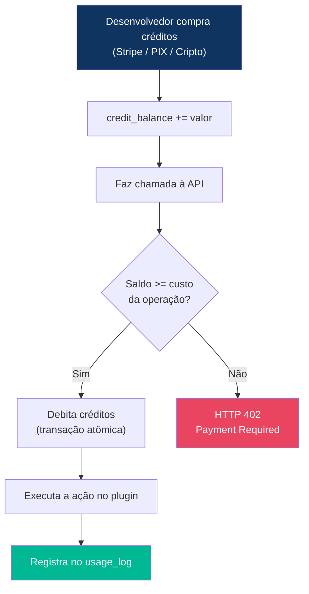
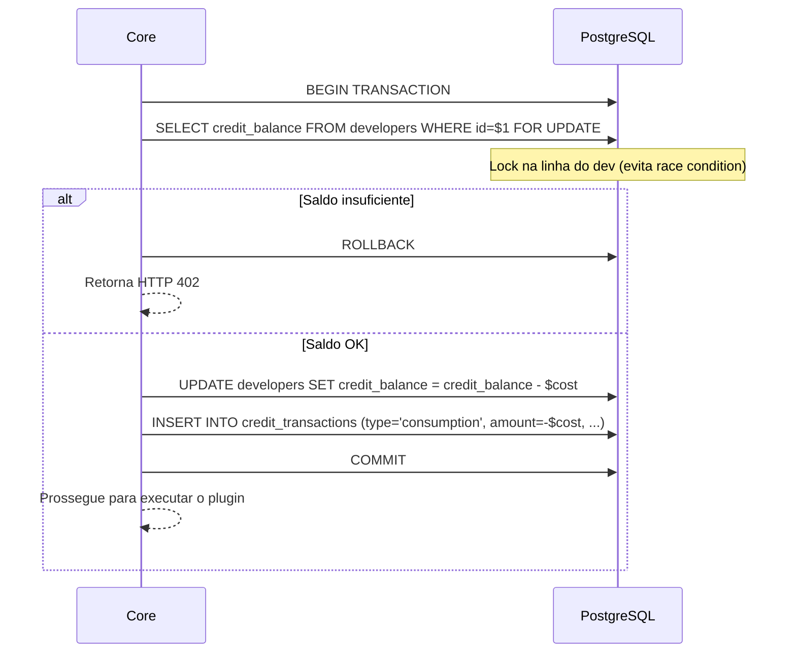

# Sistema de Créditos e Billing

> **Modelo:** Pré-pago por créditos (inspirado em OpenRouter, Anthropic, etc)
> **Moeda interna:** Créditos (1 crédito ≈ R$0,01 ou valor configurável)

---

## 1. Como Funciona



---

## 2. Tabela de Preços por Plugin

Cada plugin define seu custo no `manifest.json`. O Core lê esse valor e debita automaticamente.

| Plugin | Custo Padrão | Ações Premium | Exemplo de Uso |
|--------|-------------|---------------|----------------|
| **DNS Manager** | 1 crédito/call | — | Listar zonas, criar registro |
| **Storage** | 5 créditos/MB | upload_large: 20 | Upload/download de arquivos |
| **Deploy** | 10 créditos/call | rollback: 5 | Fazer deploy de container |
| **AI/LLM Proxy** | 50 créditos/call | generate_image: 200, fine_tune: 1000 | Gerar texto, imagem |
| **Web Scraper** | 20 créditos/call | full_render: 50 | Scrape de URL |
| **Backup Tool** | 15 créditos/call | restore: 30 | Backup de banco de dados |

### Configuração no manifest.json
```json
{
  "billing": {
    "model": "per_call",
    "credit_cost": 50,
    "premium_actions": {
      "generate_image": 200,
      "fine_tune": 1000
    }
  }
}
```

---

## 3. Fluxo de Débito (Transação Atômica)

Para evitar inconsistências (ex: cobrar sem executar, ou executar sem cobrar):



### Reembolso Automático em Caso de Falha

Se o plugin retornar erro 5xx (falha interna), o Core **reembolsa automaticamente**:

```text
1. Plugin retorna status 500
2. Core detecta que é erro do plugin (não do cliente)
3. Core executa: credit_balance += custo_cobrado
4. Core registra credit_transaction tipo "refund"
5. Resposta ao cliente inclui: "credits_refunded": true
```

---

## 4. Planos de Conta

| Plano | Preço | Créditos/mês | Rate Limit | Features |
|-------|-------|-------------|------------|----------|
| **Free** | Grátis | 100 créditos | 10 req/min | Acesso a plugins básicos |
| **Starter** | R$29/mês | 5.000 créditos | 60 req/min | Todos os plugins |
| **Pro** | R$99/mês | 25.000 créditos | 300 req/min | + Prioridade no suporte |
| **Enterprise** | Sob consulta | Ilimitado | Customizado | + SLA, dedicado |

---

## 5. Endpoints de Billing

### `GET /v1/account/credits` — Consultar Saldo
```json
{
  "success": true,
  "data": {
    "balance": 4850.00,
    "plan": "pro",
    "monthly_allowance": 25000,
    "used_this_month": 20150
  }
}
```

### `GET /v1/account/credits/history` — Histórico de Transações
```json
{
  "success": true,
  "data": {
    "transactions": [
      {"type": "purchase", "amount": 5000, "balance_after": 5000, "description": "Compra via PIX"},
      {"type": "consumption", "amount": -50, "balance_after": 4950, "description": "ai-proxy: generate"},
      {"type": "refund", "amount": 50, "balance_after": 5000, "description": "Reembolso: ai-proxy erro 500"}
    ]
  }
}
```

### `GET /v1/account/usage/summary` — Resumo de Consumo
```json
{
  "success": true,
  "data": {
    "period": "2026-05",
    "total_calls": 1542,
    "total_credits": 20150,
    "by_plugin": [
      {"plugin": "ai-proxy", "calls": 200, "credits": 10000},
      {"plugin": "dns", "calls": 1200, "credits": 1200},
      {"plugin": "scraper", "calls": 142, "credits": 2840}
    ]
  }
}
```

---

## Documentos Relacionados

- **Anterior:** [04-plugin-development-guide.md](./04-plugin-development-guide.md)
- **Próximo:** [06-security.md](./06-security.md)
