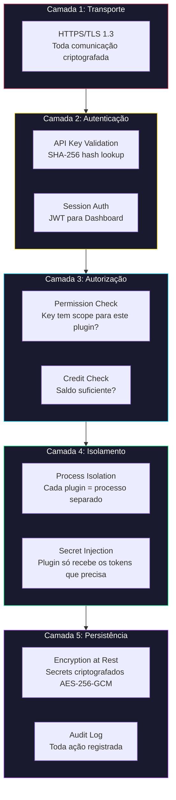
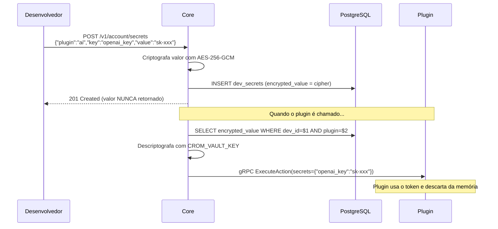
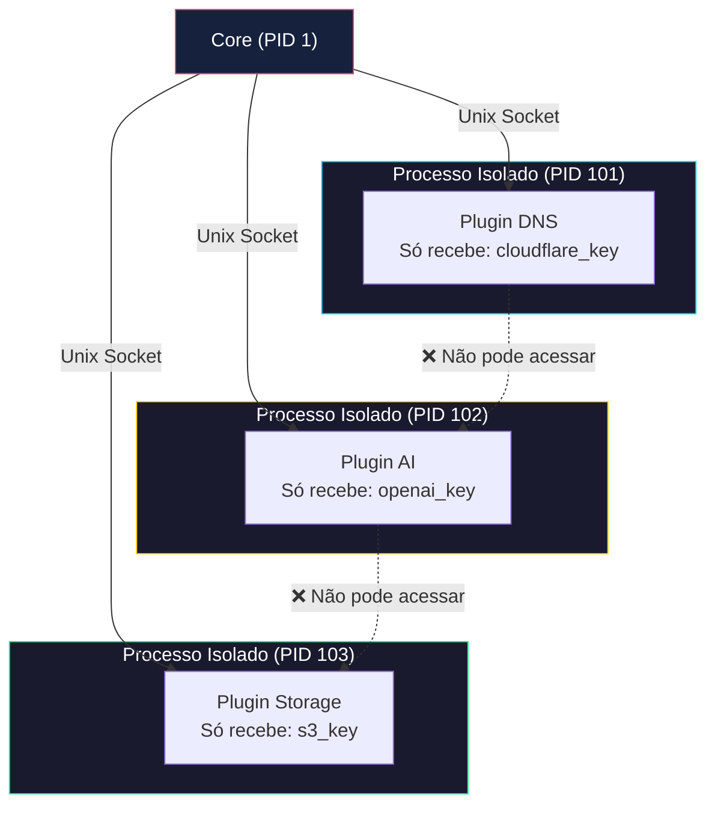

# Segurança, Cofre de Secrets e Isolamento

> **Princípio:** Zero Trust entre Core e Plugins. Cada componente só sabe o mínimo necessário.

---

## 1. Camadas de Segurança



---

## 2. API Keys — Segurança

### Geração
```text
1. Sistema gera 48 bytes aleatórios (crypto/rand)
2. Codifica em base62: crom_sk_live_7f3a8b2c4d5e6f7g...
3. Calcula SHA-256 do valor completo
4. Armazena APENAS o hash no banco (nunca o valor original)
5. Retorna o valor completo ao dev UMA ÚNICA VEZ
6. O prefixo (primeiros 8 chars) é armazenado separado para exibição
```

### Validação (a cada request)
```text
1. Extrai Bearer token do header Authorization
2. Calcula SHA-256 do token recebido
3. Busca no banco: SELECT * FROM api_keys WHERE key_hash = $hash
4. Verifica: is_active = true, expires_at > NOW()
5. Carrega permissões da key_permissions
6. Atualiza last_used_at
```

### Revogação
```text
- Imediata: UPDATE api_keys SET is_active = false WHERE id = $id
- O cache Redis (TTL 5min) pode manter a key ativa por até 5 minutos
- Para revogação instantânea: DELETE FROM Redis WHERE key = apikey:{hash}
```

---

## 3. Cofre de Secrets (Vault)

Os tokens externos dos desenvolvedores (API keys da AWS, OpenAI, etc) são armazenados criptografados.

### Criptografia
```text
Algoritmo: AES-256-GCM (Galois/Counter Mode)
Chave mestra: Variável de ambiente CROM_VAULT_KEY (32 bytes)
Nonce: 12 bytes aleatórios por secret (armazenado junto)
```

### Fluxo de Uso


### Regras do Cofre
1. **Nunca loggar** valores de secrets (nem em debug)
2. **Nunca retornar** valores na API (GET /secrets retorna só metadata)
3. **Rotação de chave mestra:** Requer re-criptografia de todos os secrets
4. O Core descriptografa **apenas no momento do despacho** e envia via gRPC (in-memory, nunca em disco)

---

## 4. Isolamento de Plugins

### Por que isolar?
Se o plugin "Scraper" for comprometido, ele **não pode** acessar os tokens de "AI" de outro dev.

### Como?
| Mecanismo | Descrição |
|-----------|-----------|
| **Processo separado** | Cada plugin roda como subprocesso independente |
| **gRPC sobre Unix Socket** | Comunicação local, sem rede exposta |
| **Injeção seletiva de secrets** | Plugin só recebe os tokens declarados no seu `required_secrets` |
| **Sem acesso ao DB** | Plugin não tem credenciais do PostgreSQL |
| **Sem acesso a outros plugins** | Não existe comunicação plugin-to-plugin |

### Diagrama de Isolamento


---

## 5. Rate Limiting

| Nível | Configuração | Armazenamento |
|-------|-------------|---------------|
| **Global** | 1000 req/min por IP | Redis: `ratelimit:ip:{ip}:{minute}` |
| **Por API Key** | Configurável (padrão 60 rpm) | Redis: `ratelimit:key:{id}:{minute}` |
| **Por Plugin** | Configurável no manifest | Redis: `ratelimit:plugin:{slug}:{minute}` |

Header de resposta quando rate limited:
```text
HTTP/1.1 429 Too Many Requests
Retry-After: 32
X-RateLimit-Limit: 60
X-RateLimit-Remaining: 0
X-RateLimit-Reset: 1714867200
```

---

## 6. Checklist de Segurança

- [ ] HTTPS obrigatório em produção (Let's Encrypt / Cloudflare) — *deploy-time*
- [x] API Keys armazenadas como SHA-256 hash (nunca plaintext) — `models/apikey.go`
- [x] Secrets criptografados com AES-256-GCM — `vault/secrets.go` (testado)
- [x] Chave mestra em variável de ambiente (`VAULT_KEY`) — `.env`
- [x] Rate limiting implementado em Redis — `server/ratelimit.go`
- [x] Audit log de ações sensíveis — `security_event` via slog
- [x] Plugins sem acesso direto ao banco de dados — isolamento via gRPC
- [ ] Comunicação Core↔Plugin via Unix Socket — *planejado para v2*
- [x] Headers de segurança (HSTS, CSP, X-Frame-Options, nosniff) — `server/middleware.go`
- [x] Sanitização de input em todas as rotas — `server/sanitize.go` (testado)

---

## Documentos Relacionados

- **Anterior:** [05-credit-system.md](./05-credit-system.md)
- **Próximo:** [07-project-structure.md](./07-project-structure.md)
