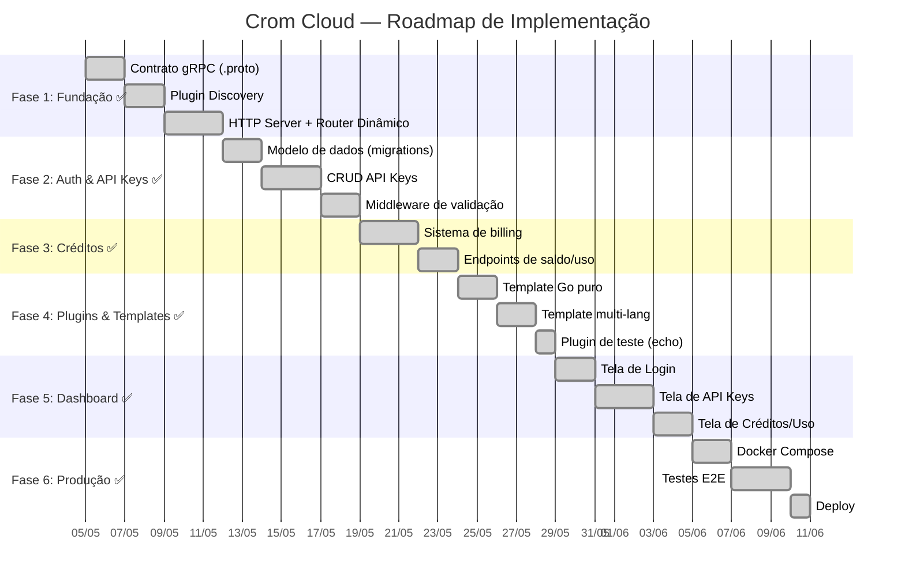

# Roadmap — Fases de Implementação

> **Status:** ✅ MVP Completo — Todas as 6 fases concluídas
> **Última atualização:** 2026-05-05

---

## Visão Geral das Fases

---

## Fase 1 — Fundação ✅

O Core consegue descobrir, iniciar e se comunicar com um plugin via gRPC.

- [x] Inicializar repositório com `go.work` (core + plugin de teste)
- [x] Criar `core/proto/plugin.proto` (contrato gRPC)
- [x] Gerar código Go a partir do `.proto` (`protoc --go_out`)
- [x] Implementar `core/internal/gateway/discovery.go` (escanear `/plugins/`)
- [x] Implementar `core/internal/gateway/dispatcher.go` (HTTP → gRPC)
- [x] Criar esqueleto do HTTP Server (`core/cmd/crom-cloud/main.go`)
- [x] Criar plugin "echo" para teste (`plugins/echo/`)
- [x] **Teste:** `curl localhost:8080/v1/echo/ping` → `{"data": "pong"}` ✅

---

## Fase 2 — Autenticação e API Keys ✅

- [x] Criar migrações SQL (developers, api_keys, key_permissions)
- [x] Implementar models (developer.go, apikey.go)
- [x] Implementar auth middleware (API Key SHA-256 + HasPermission)
- [x] Implementar JWT para sessões do Dashboard
- [x] Endpoints: register, login, CRUD keys
- [x] **Teste:** Sem key = 401, sem scope = 403, key válida = 200 ✅

---

## Fase 3 — Sistema de Créditos ✅

- [x] Migrações SQL (credit_transactions, usage_logs)
- [x] Implementar billing (débito atômico FOR UPDATE)
- [x] Pipeline: Auth → Billing → Dispatch
- [x] Reembolso em caso de erro 5xx
- [x] Endpoints: credits, credits/history, usage, usage/summary
- [x] **Teste:** Créditos debitados corretamente, saldo zero = 402 ✅

---

## Fase 4 — Plugins e Templates ✅

- [x] Template Go puro (`templates/template-go/`)
- [x] Template multi-linguagem (`templates/template-multilang/`)
- [x] Scaffolding: `tools/create-plugin.sh` (Go, Python, Node, Bash)
- [x] Cofre de Secrets (AES-256-GCM)
- [x] Endpoints: CRUD secrets
- [x] **Teste:** Scaffolding gera plugin funcional (Go + Python testados) ✅

---

## Fase 5 — Dashboard Web ✅

- [x] SPA com HTML/CSS/JS vanilla (dark mode premium)
- [x] Telas: login, dashboard, keys, secrets, billing, plugins, docs
- [x] Frontend embutido no binário via `embed.FS`
- [x] Responsivo: 3 breakpoints (1024/768/480px)
- [x] Google Fonts (Inter), Lucide Icons, animações CSS
- [x] **Teste:** Dashboard serve HTML 200, CSS 22KB, JS carrega ✅

---

## Fase 6 — Produção ✅

- [x] `Dockerfile` multi-stage (Go → Alpine, non-root)
- [x] `docker-compose.yml` (Core + PG + Redis, Docker/Podman)
- [x] Testes E2E: 23/23 via curl
- [x] Testes unitários: 24 Go tests (auth, gateway, server, vault)
- [x] Rate limiting via Redis
- [x] Security headers (HSTS, CSP, X-Frame-Options)
- [x] Sanitização de inputs
- [x] **Teste:** `make test-all` → todos os testes passam ✅

---

## Próximos Passos (Pós-MVP)

| Prioridade | Item | Descrição |
|------------|------|-----------|
| Alta | CI/CD | Pipeline de build, test, deploy automatizado |
| Alta | Plugin real | Primeiro plugin de produção (DNS, AI proxy, etc.) |
| Média | Stripe/PIX | Integração de pagamento para compra de créditos |
| Média | Marketplace | Permitir devs externos criarem e publicarem plugins |
| Baixa | Grafana | Dashboard de monitoramento e métricas |
| Baixa | WebSocket | Suporte a plugins com conexões persistentes |

---

## Documentos Relacionados

- **Anterior:** [07-project-structure.md](./07-project-structure.md)
- **Índice:** [00-visao-geral.md](./00-visao-geral.md)
