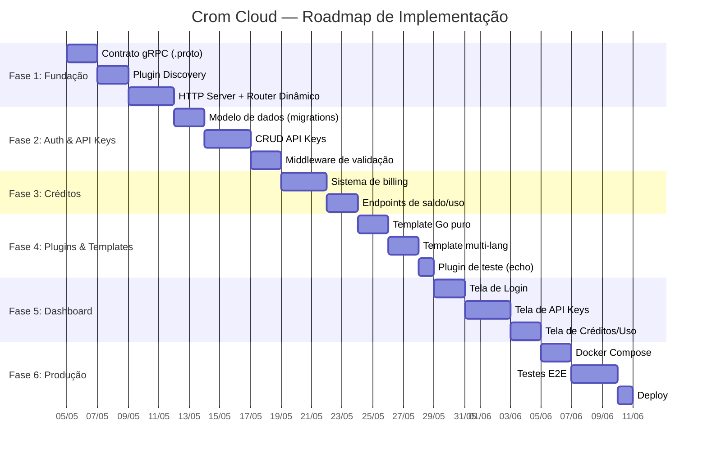

# Roadmap — Checklist de Execução por Fases

> **Estimativa total para MVP:** ~3-4 semanas
> **Metodologia:** Fases sequenciais, cada uma entrega valor incremental

---

## Visão Geral das Fases

---

## Fase 1 — Fundação (Semana 1)

O Core consegue descobrir, iniciar e se comunicar com um plugin via gRPC.

- [ ] Inicializar repositório com `go.work` (core + plugin de teste)
- [ ] Criar `core/proto/plugin.proto` (contrato gRPC)
- [ ] Gerar código Go a partir do `.proto` (`protoc --go_out`)
- [ ] Implementar `core/internal/gateway/discovery.go` (escanear `/plugins/`)
- [ ] Implementar `core/internal/gateway/dispatcher.go` (HTTP → gRPC)
- [ ] Criar esqueleto do HTTP Server (`core/cmd/crom-cloud/main.go`)
- [ ] Criar plugin dummy "echo" para teste (`plugins/echo/`)
- [ ] **Teste:** Requisição HTTP → Core → gRPC → Plugin Echo → Resposta

**Critério de Sucesso:** `curl localhost:8080/v1/echo/ping` retorna `{"data": "pong"}`.

---

## Fase 2 — Autenticação e API Keys (Semana 2)

Desenvolvedores podem se registrar, criar API Keys com permissões granulares.

- [ ] Criar migrações SQL (developers, api_keys, key_permissions)
- [ ] Implementar `core/internal/models/developer.go`
- [ ] Implementar `core/internal/models/apikey.go`
- [ ] Implementar `core/internal/auth/apikey.go` (validação SHA-256)
- [ ] Implementar `core/internal/auth/permissions.go` (scope check)
- [ ] Implementar middleware de auth no router
- [ ] Endpoints: `POST /v1/account/register`, `POST /v1/account/login`
- [ ] Endpoints: `POST /v1/account/keys`, `GET /v1/account/keys`, `DELETE /v1/account/keys/{id}`
- [ ] **Teste:** Criar key com scope `echo:read`, fazer request, verificar que funciona. Revogar key, verificar 401.

**Critério de Sucesso:** Request sem key = 401. Key sem scope = 403. Key válida = 200.

---

## Fase 3 — Sistema de Créditos (Semana 2-3)

Cada chamada à API consome créditos. Saldo zerado = 402.

- [ ] Criar migrações SQL (credit_transactions, usage_logs)
- [ ] Implementar `core/internal/billing/credits.go` (débito atômico)
- [ ] Implementar `core/internal/billing/pricing.go` (lê custo do manifest)
- [ ] Implementar `core/internal/billing/usage.go` (registra consumo)
- [ ] Middleware de billing no pipeline (após auth, antes de dispatch)
- [ ] Reembolso automático em caso de erro 5xx do plugin
- [ ] Endpoints: `GET /v1/account/credits`, `GET /v1/account/usage`
- [ ] **Teste:** Dev com 100 créditos chama plugin que custa 10 → saldo = 90. Dev com 5 créditos chama plugin que custa 10 → 402.

**Critério de Sucesso:** Créditos debitados corretamente. Saldo zero = 402.

---

## Fase 4 — Plugins e Templates (Semana 3)

Templates funcionais e pelo menos um plugin real.

- [ ] Criar `templates/template-go/` com todos os arquivos `.tmpl`
- [ ] Criar `templates/template-multilang/` com bridge.go genérico
- [ ] Criar `tools/create-plugin.sh` (scaffolding automático)
- [ ] Implementar Cofre de Secrets (`core/internal/vault/secrets.go`)
- [ ] Endpoints: `POST /v1/account/secrets`, `GET /v1/account/secrets`
- [ ] Criar primeiro plugin real (dns-manager ou outro)
- [ ] **Teste:** Rodar `./tools/create-plugin.sh test-plugin --lang=python`, compilar, verificar que o Core detecta.

**Critério de Sucesso:** `create-plugin.sh` gera plugin funcional em <1 minuto.

---

## Fase 5 — Dashboard Web (Semana 3-4)

Interface web para gerenciar conta, keys, secrets e visualizar uso.

- [ ] Setup do frontend (HTML/CSS/JS ou framework leve)
- [ ] Tela de login/registro
- [ ] Tela de Dashboard (saldo, uso recente, plugins ativos)
- [ ] Tela de API Keys (criar, configurar permissões, revogar)
- [ ] Tela de Cofre de Secrets (cadastrar tokens externos)
- [ ] Tela de Uso e Créditos (gráficos de consumo por plugin)
- [ ] Listagem dinâmica de plugins (lê `GET /v1/system/plugins`)
- [ ] **Teste:** Criar key pelo dashboard, usar via curl, verificar uso no dashboard.

**Critério de Sucesso:** Todo o ciclo CRUD funciona pelo dashboard.

---

## Fase 6 — Produção (Semana 4)

Deploy, testes E2E e hardening.

- [ ] `Dockerfile` para o Core
- [ ] `docker-compose.yml` (Core + PostgreSQL + Redis)
- [ ] Testes E2E automatizados (ver pasta `/tests/`)
- [ ] Rate limiting via Redis
- [ ] Headers de segurança (HSTS, CSP)
- [ ] CI/CD pipeline (build, test, deploy)
- [ ] Documentação pública da API
- [ ] **Teste:** `docker-compose up` sobe tudo, todos os testes passam.

**Critério de Sucesso:** MVP funcional rodando em Docker com todos os testes verdes.

---

## Documentos Relacionados

- **Anterior:** [07-project-structure.md](./07-project-structure.md)
- **Índice:** [00-visao-geral.md](./00-visao-geral.md)
