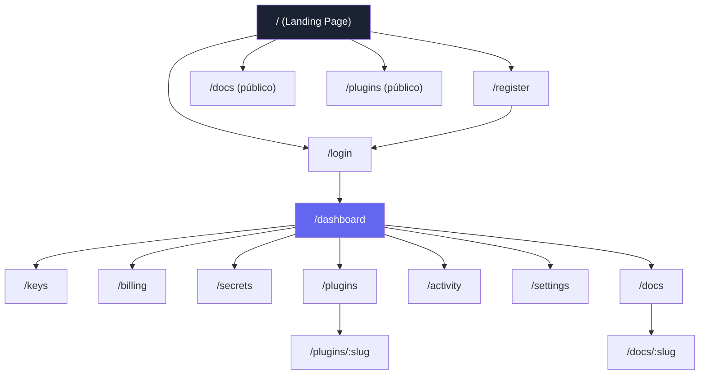
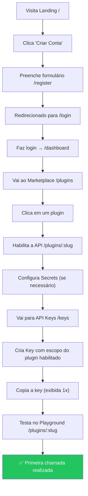
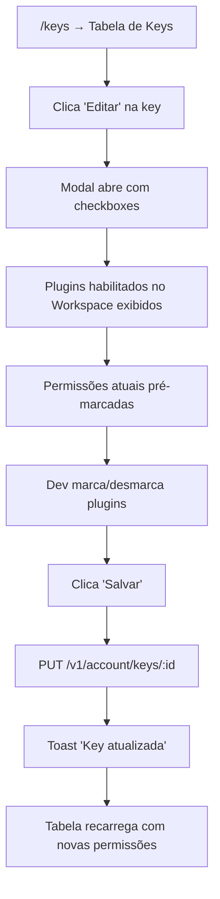

# Crom Cloud — Especificação UX/UI Completa do Dashboard

> **Versão:** 1.0 · **Última atualização:** 2026-05-05
> **Referências de mercado:** GCP Console, AWS Console, Stripe Dashboard, Vercel, Cloudflare, OpenRouter

---

## Índice

1. [Filosofia de Design](#1-filosofia-de-design)
2. [Mapa de Páginas](#2-mapa-de-páginas)
3. [Componentes Globais](#3-componentes-globais)
4. [Páginas Públicas](#4-páginas-públicas)
5. [Páginas Autenticadas (Dashboard)](#5-páginas-autenticadas-dashboard)
6. [Fluxos de Usuário Críticos](#6-fluxos-de-usuário-críticos)
7. [Dados por Página](#7-dados-por-página-api-endpoints)
8. [Gaps Atuais vs. Ideal](#8-gaps-atuais-vs-ideal)

---

## 1. Filosofia de Design

### Princípios Fundamentais

| Princípio | Descrição | Referência |
|-----------|-----------|------------|
| **Progressive Disclosure** | Mostrar apenas o essencial; detalhes em modais ou subpáginas | Stripe |
| **Workspace-Centric** | Toda ação está contextualizada no Workspace do dev (como "Projetos" no GCP) | GCP |
| **API-First UI** | O Dashboard é um cliente da própria API. Tudo que o UI faz, a API também faz | OpenRouter |
| **Zero-Friction Onboarding** | Do registro à primeira chamada de API em menos de 2 minutos | Vercel |
| **Security by Default** | Secrets nunca expostos, chaves com hash, scopes granulares | Stripe / AWS IAM |
| **Dark Mode Premium** | Paleta escura com acentos gradientes (indigo/violeta), tipografia Inter | Vercel |

### Design System

| Token | Valor | Uso |
|-------|-------|-----|
| `--bg-primary` | `#0a0e17` | Fundo do body |
| `--bg-card` | `#1a2233` | Fundo de cards e painéis |
| `--accent` | `#6366f1 → #8b5cf6` | Gradiente principal (botões, links) |
| `--success` | `#22c55e` | Estados ativos, habilitados |
| `--danger` | `#ef4444` | Ações destrutivas, erros |
| `--warning` | `#f59e0b` | Alertas, secrets, avisos |
| `--text-primary` | `#f1f5f9` | Texto principal |
| `--text-secondary` | `#64748b` | Labels, descrições |
| `--font-body` | Inter | Texto geral |
| `--font-code` | JetBrains Mono | Código, prefixos de chaves, endpoints |

---

## 2. Mapa de Páginas

### Rotas Protegidas vs. Públicas

| Rota | Auth | Descrição |
|------|------|-----------|
| `/` | ❌ | Landing page (marketing) |
| `/login` | ❌ | Formulário de login |
| `/register` | ❌ | Formulário de registro |
| `/docs` | ❌ | Documentação pública (também acessível logado) |
| `/plugins` | ❌ | Catálogo público (logado = mostra status do workspace) |
| `/dashboard` | ✅ | Visão geral da conta |
| `/keys` | ✅ | Gerenciamento de API Keys |
| `/billing` | ✅ | Créditos, consumo e pagamentos |
| `/secrets` | ✅ | Cofre de secrets (Vault) |
| `/plugins/:slug` | ❌/✅ | Detalhe do plugin (logado = habilitar/playground) |
| `/activity` | ✅ | Log de requisições realizadas |
| `/settings` | ✅ | Perfil, conta e zona de perigo |

---

## 3. Componentes Globais

### 3.1 Sidebar (somente logado)

| Item | Ícone | Rota | Badge dinâmico |
|------|-------|------|----------------|
| Dashboard | `dashboard` | `/dashboard` | — |
| API Keys | `key` | `/keys` | Nº de keys ativas |
| Marketplace | `puzzle` | `/plugins` | Nº de plugins habilitados |
| Créditos | `credit-card` | `/billing` | Saldo atual |
| Secrets | `lock` | `/secrets` | Nº de secrets |
| Atividade | `activity` | `/activity` | — |
| Docs | `book-open` | `/docs` | — |
| Configurações | `settings` | `/settings` | — |

**Referência (Stripe):** O sidebar deve ser fixo à esquerda, colapsável, e com o logo no topo. O item ativo deve ter destaque visual claro (borda lateral ou fundo acentuado).

### 3.2 Topbar

| Elemento | Posição | Função |
|----------|---------|--------|
| Breadcrumbs | Esquerda | Navegação hierárquica (Dashboard > Keys > Editar) |
| Command Palette (`Ctrl+K`) | Centro | Busca rápida global de páginas e ações |
| Avatar + Menu | Direita | Nome, email, logout |

### 3.3 Toast Notifications

| Tipo | Cor | Duração | Uso |
|------|-----|---------|-----|
| `success` | Verde | 3s | Ações concluídas (key criada, plugin habilitado) |
| `error` | Vermelho | 5s | Erros de validação, falhas de API |
| `warning` | Amarelo | 4s | Avisos (saldo baixo, funcionalidade limitada) |
| `info` | Azul | 3s | Informações contextuais |

### 3.4 Modais

**Quando usar:** Ações rápidas e contextuais (criar key, editar escopo, novo secret).
**Quando NÃO usar:** Fluxos complexos com múltiplas etapas (esses devem ser páginas dedicadas).

---

## 4. Páginas Públicas

### 4.1 Landing Page (`/`)

**Propósito:** Converter visitantes em usuários registrados.
**Referência:** Vercel, Stripe.

| Seção | Conteúdo | Por que |
|-------|----------|---------|
| **Hero** | Headline com gradiente, subtítulo explicativo, CTAs "Criar Conta" e "Ver Docs" | Primeira impressão. Deve comunicar o valor em 5 segundos |
| **Features Grid** | 6 cards (API Unificada, Uma Key, Pay-per-use, Vault, Extensível, Observabilidade) | Explicar benefícios, não funcionalidades técnicas |
| **Code Preview** | Terminal estilizado mostrando `curl` + resposta | Devs confiam em exemplos práticos |
| **Footer** | Links, copyright | Completude |

**O que NÃO deve ter:** Tabelas de preço detalhadas (reservar para `/billing`), formulários longos.

### 4.2 Login (`/login`)

| Elemento | Obrigatório | Atual | Ideal |
|----------|-------------|-------|-------|
| Input Email | ✅ | ✅ | ✅ |
| Input Senha | ✅ | ✅ | ✅ |
| Botão "Mostrar Senha" | ✅ | ✅ | ✅ |
| Link para Registro | ✅ | ✅ | ✅ |
| "Esqueci minha senha" | ✅ | ❌ | ⚠️ Implementar |
| Loading state no botão | ✅ | ✅ | ✅ |
| Redirect se já logado | ✅ | ✅ | ✅ |
| OAuth (GitHub/Google) | Desejável | ❌ | Futuro |

### 4.3 Registro (`/register`)

| Elemento | Obrigatório | Atual | Ideal |
|----------|-------------|-------|-------|
| Input Nome | ✅ | ✅ | ✅ |
| Input Email | ✅ | ✅ | ✅ |
| Input Senha (com validação visual) | ✅ | ✅ | ⚠️ Adicionar barra de força |
| Termos de Serviço (checkbox) | ✅ | ❌ | ⚠️ Implementar |
| Redirect para Login após sucesso | ✅ | ✅ | ✅ |

---

## 5. Páginas Autenticadas (Dashboard)

### 5.1 Dashboard (`/dashboard`)

**Propósito:** Fornecer visão geral instantânea ("Tudo está OK?") em até 3 segundos.
**Referência:** GCP Dashboard, Stripe Home.

#### Dados Exibidos (Stat Cards)

| Métrica | Fonte API | Formato | Ícone |
|---------|-----------|---------|-------|
| Saldo de Créditos | `GET /account/balance` | `$XXX.XX` | `wallet` |
| API Keys Ativas | `GET /account/keys` → filtrar `is_active` | Número | `key` |
| Plugins Habilitados | `GET /account/plugins` | Número | `puzzle` |
| Secrets Configurados | `GET /account/secrets` | Número | `lock` |

#### Seções do Dashboard

| Seção | Conteúdo | Ação |
|-------|----------|------|
| **Stat Cards** (4x) | As 4 métricas acima em grid responsivo | Click → navega para a página correspondente |
| **Ações Rápidas** | Botões: Criar Key, Adicionar Créditos, Configurar Secret, Ver Docs | Click → navega |
| **Plugins Habilitados** | Tabela com nome, versão, status, nº rotas (apenas os habilitados no workspace) | Click no plugin → `/plugins/:slug` |
| **API Keys Recentes** | Últimas 5 keys com label, prefixo, permissões, último uso, status | Click "Gerenciar" → `/keys` |

**O que NÃO deve ter:** Formulários de criação (usar modais). Dados excessivos (usar `/activity` para detalhes).

**O que FALTA atualmente:**
- [ ] Stat card "Plugins Habilitados" mostra todos os plugins, deveria mostrar apenas os habilitados no workspace
- [ ] Gráfico de consumo dos últimos 7 dias (sparkline ou bar chart)
- [ ] Alerta visual quando o saldo está abaixo de um limiar (ex: < 10 créditos)

---

### 5.2 API Keys (`/keys`)

**Propósito:** Gerenciar credenciais de acesso à API. Centro de segurança do desenvolvedor.
**Referência:** Stripe API Keys, GCP Credentials.

#### Tabela de Keys

| Coluna | Dado | Formato |
|--------|------|---------|
| Label | `key.label` | Texto bold |
| Prefixo | `key.key_prefix` | Monospace + `...` |
| Plugins (Escopo) | `key.permissions[].plugin_slug` | Tags/badges |
| Rate Limit | `key.rate_limit_rpm` | `XX/min` |
| Último Uso | `key.last_used_at` | Tempo relativo |
| Status | `key.is_active` | Badge verde/vermelho |
| Ações | — | Botões: `Editar` · `Revogar` |

#### Ações

| Ação | Tipo | UI | Comportamento |
|------|------|-----|---------------|
| **Nova Key** | Botão primário (topo) | Modal | Campos: Label, Checkboxes de plugins habilitados. Resultado: exibe key completa 1 vez |
| **Editar Escopo** | Botão secundário (linha) | Modal | Checkboxes pré-selecionados. PUT `/account/keys/:id` |
| **Revogar** | Botão danger (linha) | Modal de confirmação | DELETE `/account/keys/:id`. Irreversível |
| **Buscar** | Input no topo da tabela | Filtro inline | Filtra por label, prefixo |

**O que FALTA atualmente:**
- [ ] Botão "Editar Escopo" na tabela (em implementação)
- [ ] Expiração configurável (campo `expires_at` com date picker)
- [ ] Rate limit editável por key (input numérico no modal de criação)
- [ ] Aviso de segurança: "Nunca compartilhe suas API Keys"

---

### 5.3 Marketplace de Plugins (`/plugins`)

**Propósito:** Descobrir, habilitar e gerenciar integrações. O "marketplace" da plataforma.
**Referência:** GCP APIs & Services, Vercel Integrations.

#### Layout

| Seção | Condição | Conteúdo |
|-------|----------|----------|
| **Header** | Sempre | Título "Biblioteca de APIs", descrição |
| **Habilitados no Workspace** | Logado + tem plugins habilitados | Grid de cards com borda verde |
| **Catálogo de APIs** | Sempre | Grid de cards restantes com borda neutra |

#### Card de Plugin

| Elemento | Dado | Visual |
|----------|------|--------|
| Ícone | Placeholder (puzzle) → futuramente ícone real | Circle ou rounded square colorido |
| Nome | `plugin.name` | Bold 16px |
| Versão | `plugin.version` | Small text cinza |
| Badge "Habilitado" | `enabledSlugs.includes(slug)` | Badge verde com check |
| Descrição | `plugin.description` | 2 linhas com clamp |
| Nº de rotas | `plugin.routes.length` | Badge neutro |
| Custo | `plugin.credit_cost` | Badge "Grátis" (verde) ou "X cr/req" (azul) |
| **Click** | Navega para `/plugins/:slug` | Hover com elevação |

---

### 5.4 Detalhe do Plugin (`/plugins/:slug`)

**Propósito:** Página completa do serviço. É aqui que o dev decide habilitar e aprende a usar.
**Referência:** GCP API detail page, Stripe API Reference.

#### Layout (2 colunas)

**Coluna Esquerda (300px):**

| Seção | Conteúdo |
|-------|----------|
| **Sobre esta API** | Texto explicativo do que o plugin faz |
| **Autenticação** | Instrução + code block com header `Authorization` |
| **Secrets Necessários** | Lista de secrets que o plugin precisa (ex: `CLOUDFLARE_API_TOKEN`) |
| **Links Úteis** | Documentação externa, site oficial |

**Coluna Direita (flex):**

| Seção | Conteúdo |
|-------|----------|
| **Header** | Ícone grande, Nome, Versão, Descrição, Badge "Habilitado" |
| **Custo** | Preço por requisição em destaque |
| **Botão Habilitar/Desabilitar** | Toggle de ativação no workspace |
| **Endpoints & Playground** | Lista de rotas com `method`, `path`, `description`, `scope` |
| **Playground de Teste** | Formulário por endpoint: textarea para payload (POST), botão "Executar", área de resultado |

**O que FALTA atualmente:**
- [ ] Seção "Secrets Necessários" — extrair de `manifest.json → required_secrets`
- [ ] Links para documentação externa do serviço
- [ ] Badge de status (healthy/unhealthy) extraído do health monitor
- [ ] Exibir estatísticas de uso pessoal deste plugin (chamadas no mês, custo acumulado)

---

### 5.5 Créditos & Billing (`/billing`)

**Propósito:** Ver saldo, adicionar créditos, entender consumo.
**Referência:** Stripe Billing, OpenRouter Credits.

#### Seções

| Seção | Conteúdo | Fonte API |
|-------|----------|-----------|
| **Stat Cards** | Saldo Atual, Plano, Gasto Este Mês | `GET /account/credits`, `GET /account/usage/summary` |
| **Adicionar Créditos** | Botões pré-definidos ($10, $50, $100, $250, $500, $1000) + input customizado + botão de compra | `POST /account/credits` |
| **Histórico de Transações** | Tabela com tipo (purchase/consumption/refund), valor, descrição, data | `GET /account/credits/history` |

**O que FALTA atualmente:**
- [ ] O "Gasto Este Mês" está hardcoded como `$0.00` — deveria chamar `GET /account/usage/summary`
- [ ] Gráfico de barras com consumo por plugin (breakdown visual)
- [ ] Gráfico de timeline com evolução do saldo ao longo do mês
- [ ] Integração real de pagamento (Stripe/PIX) — atualmente adiciona créditos diretamente
- [ ] Alerta de saldo baixo configurável
- [ ] Tabela de preços por plugin (quanto custa cada ferramenta)

---

### 5.6 Secrets — Cofre (`/secrets`)

**Propósito:** Armazenar tokens externos (AWS, Cloudflare, OpenAI) de forma segura.
**Referência:** GCP Secret Manager, AWS Secrets Manager.

#### Tabela de Secrets

| Coluna | Dado | Formato |
|--------|------|---------|
| Nome | `secret.secret_name` | Bold + ícone lock |
| Plugin | `secret.plugin_slug` | Tag colorida |
| Valor | Nunca exibido | `••••••••` (masked) |
| Criado | `secret.created_at` | Tempo relativo |
| Ações | — | Botão "Excluir" |

#### Ações

| Ação | UI | Campos |
|------|-----|--------|
| **Novo Secret** | Modal | Plugin (dropdown dos habilitados), Nome, Valor (password input) |
| **Excluir** | Modal de confirmação | Sem campos, apenas confirmação |

**O que FALTA atualmente:**
- [ ] O campo "Plugin Slug" na criação é um input de texto livre — deveria ser um `<select>` com a lista de plugins habilitados no workspace
- [ ] Botão "Atualizar Valor" (sobrescrever sem deletar)
- [ ] Indicador visual de quais plugins ainda precisam de secrets configurados (ex: "Cloudflare DNS requer: CLOUDFLARE_API_TOKEN ❌")
- [ ] Agrupamento visual por plugin

---

### 5.7 Atividade (`/activity`)

**Propósito:** Log de auditoria e debugging de chamadas à API.
**Referência:** Stripe Request Logs, Cloudflare Analytics.

#### Cada Registro

| Campo | Dado | Formato |
|-------|------|---------|
| Método | `log.method` | Badge colorido (GET=verde, POST=azul, DELETE=vermelho) |
| Endpoint | `log.plugin_slug + log.path` | Monospace |
| Latência | `log.latency_ms` | `Xms` |
| Custo | `log.credit_cost` | `X cr` |
| Request ID | `log.request_id` | Monospace truncado |
| Data | `log.created_at` | Tempo relativo |

**O que FALTA atualmente:**
- [ ] Filtros: por plugin, por método, por período, por status HTTP
- [ ] Paginação (atualmente limit=50 sem "carregar mais")
- [ ] Click para expandir → ver detalhes da request/response (body, headers, status)
- [ ] Indicador de sucesso/falha (status code 2xx vs 4xx/5xx)
- [ ] Exportar logs (CSV/JSON)

---

### 5.8 Documentação (`/docs`)

**Propósito:** Referência técnica da API. O dev deve conseguir integrar sem sair desta página.
**Referência:** Stripe Docs (layout 3 colunas), Twilio.

#### Estrutura

| Seção | Conteúdo |
|-------|----------|
| **Quick Start** | Passos numerados: 1. Crie conta, 2. Gere Key, 3. Faça a primeira chamada |
| **Autenticação** | Explicação do header `Authorization: Bearer` |
| **Lista de Plugins** | Cards clicáveis que levam para `/docs/:slug` |

#### Detalhe do Plugin (`/docs/:slug`)

| Seção | Conteúdo |
|-------|----------|
| Base URL | `https://api.cromcloud.com/v1/{slug}/` |
| Autenticação | Code block |
| Endpoints | Para cada rota: método, path, descrição, scope, exemplo curl |

**O que FALTA atualmente:**
- [ ] Exemplos de resposta para cada endpoint (não apenas o curl)
- [ ] Selector de linguagem (curl, Python, Node.js, Go)
- [ ] Seção de "Erros Comuns" por plugin
- [ ] Seção de "Rate Limits" por plugin
- [ ] Link direto para o Playground (`/plugins/:slug`)

---

### 5.9 Configurações (`/settings`)

**Propósito:** Gerenciar perfil e conta.
**Referência:** Qualquer dashboard SaaS moderno.

#### Seções

| Seção | Conteúdo | Ação |
|-------|----------|------|
| **Perfil** | Avatar (inicial), nome (editável), email (editável) | Botão "Salvar" |
| **Informações da Conta** | ID da conta, plano, membro desde | Somente leitura |
| **Zona de Perigo** | Excluir conta | Modal de confirmação com input "DELETAR" |

**O que FALTA atualmente:**
- [ ] "Salvar Alterações" não persiste de fato no backend (apenas toast cosmético)
- [ ] Alterar senha (input senha atual + nova senha)
- [ ] Upload de avatar
- [ ] Configuração de notificações (email para saldo baixo, key expirada)
- [ ] Upgrade de plano (Free → Starter → Pro)

---

## 6. Fluxos de Usuário Críticos

### 6.1 Onboarding (Novo Usuário → Primeira Chamada de API)

> [!IMPORTANT]
> **Oportunidade de melhoria:** No passo K, o usuário precisa ir manualmente para outra página criar a key. O ideal seria oferecer um **botão "Criar Key para este plugin"** diretamente na página do plugin detail, após habilitar.

### 6.2 Fluxo de Segurança (Edição de Escopo de Key)

---

## 7. Dados por Página (API Endpoints)

| Página | Endpoints Consumidos | Método |
|--------|---------------------|--------|
| `/dashboard` | `/account/me`, `/account/balance`, `/account/keys`, `/system/plugins`, `/account/secrets`, `/account/plugins` | GET |
| `/keys` | `/account/keys`, `/account/plugins`, `/system/plugins` | GET, POST, PUT, DELETE |
| `/plugins` | `/system/plugins`, `/account/plugins` | GET |
| `/plugins/:slug` | `/system/plugins`, `/account/plugins`, `/account/keys` | GET, POST |
| `/billing` | `/account/balance`, `/account/credits/history`, `/account/usage/summary` | GET, POST |
| `/secrets` | `/account/secrets`, `/system/plugins`, `/account/plugins` | GET, POST, DELETE |
| `/activity` | `/account/usage` | GET |
| `/docs` | `/system/plugins` | GET |
| `/settings` | `/account/me` | GET, PUT |

---

## 8. Gaps Atuais vs. Ideal

### Prioridade Alta (Impacto funcional direto)

| Gap | Página | Impacto | Referência |
|-----|--------|---------|------------|
| Edição de escopo de API Keys | `/keys` | Dev não consegue ajustar permissões sem revogar | Stripe |
| Secrets usa input de texto para plugin | `/secrets` | Erro de digitação quebra a injeção | GCP |
| Dashboard mostra todos os plugins, não apenas habilitados | `/dashboard` | Confusão sobre o que está realmente ativo | GCP |
| "Gasto Este Mês" hardcoded | `/billing` | Informação falsa exibida ao usuário | — |
| Salvar perfil não persiste | `/settings` | Funcionalidade fake | — |

### Prioridade Média (Melhoria de UX)

| Gap | Página | Benefício |
|-----|--------|-----------|
| Gráfico de consumo por plugin | `/billing` | Visualização rápida de onde o dinheiro vai |
| Filtros e paginação no log | `/activity` | Essencial quando houver volume de dados |
| Indicator de secrets faltando | `/plugins/:slug` | Dev sabe o que configurar antes de testar |
| "Criar Key para este plugin" no detalhe | `/plugins/:slug` | Reduz fricção do onboarding |
| Alterar senha | `/settings` | Funcionalidade de segurança básica |

### Prioridade Baixa (Polish)

| Gap | Página | Benefício |
|-----|--------|-----------|
| OAuth login (GitHub/Google) | `/login` | Conveniência |
| Selector de linguagem nos docs | `/docs` | Dev experience premium |
| Exportar logs | `/activity` | Compliance e debugging avançado |
| Upload de avatar | `/settings` | Personalização |
| Gráfico sparkline no dashboard | `/dashboard` | Visual premium |
