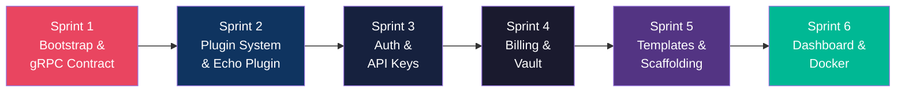
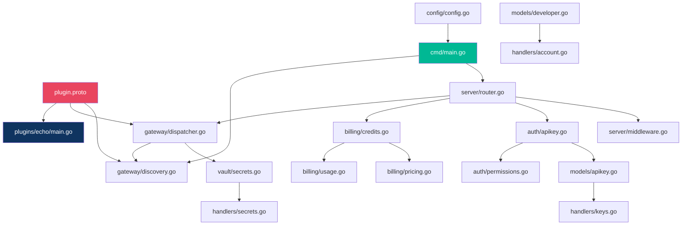

# Plano de Implementação Completo — Crom Cloud

> **Objetivo:** Construir o sistema inteiro, do zero ao MVP funcional.
> **Stack:** Go 1.22+ | PostgreSQL 16 | Redis 7 | hashicorp/go-plugin | Chi Router
> **Referência:** Toda a documentação já existente em `docs/`

---

## Decisões Técnicas (Stack Definitiva)

| Componente | Escolha | Justificativa |
|------------|---------|---------------|
| HTTP Router | `go-chi/chi` v5 | Leve, idiomatic, middleware nativo, wildcard routes |
| ORM/DB | `jackc/pgx` v5 | Driver PostgreSQL puro Go, pool de conexões, zero CGO |
| Migrações | `golang-migrate/migrate` | Padrão da indústria, CLI + lib |
| Plugin System | `hashicorp/go-plugin` | gRPC over Unix socket, usado pelo Terraform |
| Cache | `redis/go-redis` v9 | Client Redis oficial |
| Auth/Hash | `crypto/sha256` + `golang.org/x/crypto/bcrypt` | Padrão, sem deps externas |
| Vault | `crypto/aes` (stdlib) | AES-256-GCM nativo |
| Config | `joho/godotenv` + `kelseyhightower/envconfig` | Simples, .env files |
| Logging | `log/slog` (stdlib Go 1.21+) | Structured logging nativo |
| UUID | `google/uuid` | Geração de UUIDs v4 |
| Frontend | Vanilla HTML/CSS/JS servido pelo Go | Embedded via `embed.FS` |

---

## Ordem de Execução (6 Sprints)



---

## Sprint 1 — Bootstrap do Projeto e Contrato gRPC

**Objetivo:** Repositório inicializado, go.work configurado, `.proto` compilando, HTTP server respondendo.

### Arquivos a criar neste Sprint:

#### [NEW] `go.work`
Go Workspace vinculando `core/` e futuros plugins.
```go
go 1.22
use ./core
```

#### [NEW] `core/go.mod`
```text
module github.com/crom/crom-cloud/core
go 1.22
// deps: chi, pgx, go-plugin, go-redis, uuid, godotenv, migrate
```

#### [NEW] `core/proto/plugin.proto`
Contrato gRPC conforme documentado em `docs/01-architecture.md` (já temos o conteúdo completo).

#### [NEW] `core/cmd/crom-cloud/main.go`
- Carrega `.env`
- Conecta PostgreSQL (pgx pool)
- Conecta Redis
- Roda migrações automaticamente
- Inicializa Plugin Discovery
- Inicia HTTP server (Chi) na porta `:8080`
- Graceful shutdown via `os.Signal`

#### [NEW] `core/internal/server/router.go`
- Monta rotas estáticas: `/v1/account/*`, `/v1/system/*`
- Monta rotas dinâmicas: `/v1/{plugin_slug}/*` (wildcard)
- Serve arquivos estáticos do dashboard em `/`

#### [NEW] `core/internal/server/middleware.go`
- `RequestID` — gera UUID por request
- `Logger` — log estruturado com slog
- `Recoverer` — panic recovery
- `CORS` — headers de CORS
- `ContentType` — força application/json

#### [NEW] `core/internal/config/config.go`
Struct de configuração carregada de ENV:
```go
type Config struct {
    Port            string `envconfig:"PORT" default:"8080"`
    DatabaseURL     string `envconfig:"DATABASE_URL" required:"true"`
    RedisURL        string `envconfig:"REDIS_URL" default:"localhost:6379"`
    VaultKey        string `envconfig:"VAULT_KEY" required:"true"` // 32 bytes hex
    PluginsDir      string `envconfig:"PLUGINS_DIR" default:"./plugins"`
    JWTSecret       string `envconfig:"JWT_SECRET" required:"true"`
}
```

#### [NEW] `.env.example`
#### [NEW] `.gitignore`
#### [NEW] `Makefile` (raiz)
Targets: `proto`, `build`, `dev`, `test`, `migrate-up`, `migrate-down`

#### [NEW] `docker-compose.yml`
PostgreSQL 16 + Redis 7 para desenvolvimento local.

**Verificação Sprint 1:**
```bash
docker-compose up -d                    # Sobe PG + Redis
cd core && go build ./cmd/crom-cloud    # Compila
./crom-cloud                            # Inicia (deve logar "Server started on :8080")
curl localhost:8080/v1/system/health     # {"status":"ok"}
```

---

## Sprint 2 — Plugin System e Echo Plugin

**Objetivo:** O Core descobre, inicia e se comunica com um plugin via gRPC. `curl /v1/echo/ping` funciona.

### Arquivos a criar:

#### [NEW] `core/internal/gateway/discovery.go`
- `DiscoverPlugins(dir string)` — escaneia subpastas, lê `manifest.json`
- Valida manifest (slug, binary, routes obrigatórios)
- Inicia cada binário via `hashicorp/go-plugin`
- Armazena mapa: `map[slug]*PluginClient`

#### [NEW] `core/internal/gateway/dispatcher.go`
- Recebe request HTTP em `/v1/{slug}/{action...}`
- Extrai slug + action do path
- Busca plugin no mapa de discovery
- Monta `ActionRequest` protobuf (payload, headers)
- Chama `ExecuteAction()` via gRPC
- Converte `ActionResponse` para HTTP response padronizada

#### [NEW] `core/internal/gateway/health.go`
- Goroutine que roda a cada 30s
- Chama `HealthCheck()` em cada plugin ativo
- Marca plugins mortos como `unavailable`

#### [NEW] `core/internal/gateway/manifest.go`
- Struct `PluginManifest` (espelho do JSON)
- Func `LoadManifest(path)` e `ValidateManifest(m)`

#### [NEW] `plugins/echo/manifest.json`
```json
{"slug":"echo","name":"Echo Test","version":"1.0.0",
 "runtime":{"binary":"./echo.bin","language":"go"},
 "billing":{"credit_cost":0},
 "api_routes":[
   {"method":"GET","path":"/ping","scope":"read"},
   {"method":"POST","path":"/reflect","scope":"write"}
]}
```

#### [NEW] `plugins/echo/main.go`
Plugin gRPC que implementa `CromPlugin` interface. Registra-se via `go-plugin`.

#### [NEW] `plugins/echo/handler.go`
- `ping` → retorna `{"message":"pong"}`
- `reflect` → retorna o payload recebido de volta

#### [NEW] `plugins/echo/go.mod`
#### [NEW] `plugins/echo/Makefile`
Atualizar `go.work` para incluir `./plugins/echo`.

**Verificação Sprint 2:**
```bash
cd plugins/echo && make build            # Compila echo.bin
cd ../.. && make dev                     # Inicia Core
curl localhost:8080/v1/echo/ping         # {"success":true,"data":{"message":"pong"}}
curl -X POST -d '{"msg":"hi"}' localhost:8080/v1/echo/reflect  # Eco do payload
curl localhost:8080/v1/system/plugins    # Lista echo como ativo
```

---

## Sprint 3 — Autenticação e API Keys

**Objetivo:** Registro, login, CRUD de API Keys com permissões por plugin. Rotas protegidas.

### Migrações SQL:

#### [NEW] `migrations/001_create_developers.{up,down}.sql`
#### [NEW] `migrations/002_create_api_keys.{up,down}.sql`
#### [NEW] `migrations/003_create_key_permissions.{up,down}.sql`

(SQL já definido em `docs/02-database-schema.md`)

### Models:

#### [NEW] `core/internal/models/developer.go`
- `Create(email, name, password)` — bcrypt hash
- `FindByEmail(email)` — login lookup
- `FindByID(id)` — busca por UUID

#### [NEW] `core/internal/models/apikey.go`
- `Generate(devID, label, permissions[])` — gera key, hash SHA-256, salva
- `ValidateByHash(hash)` — busca key + permissões
- `Revoke(keyID)` — set is_active=false
- `ListByDeveloper(devID)` — lista keys (sem valores)

### Auth:

#### [NEW] `core/internal/auth/apikey.go`
- Extrai `Bearer` do header
- Calcula SHA-256
- Busca no DB (com cache Redis 5min)
- Retorna `AuthContext{DevID, KeyID, Permissions}`

#### [NEW] `core/internal/auth/permissions.go`
- `HasPermission(perms, pluginSlug, requiredScope) bool`
- Hierarquia: admin > write > read

#### [NEW] `core/internal/auth/session.go`
- JWT para login no Dashboard (separado da API Key)
- `GenerateJWT(devID)` e `ValidateJWT(token)`

### Handlers (REST endpoints):

#### [NEW] `core/internal/handlers/account.go`
- `POST /v1/account/register` — cria conta
- `POST /v1/account/login` — retorna JWT
- `GET /v1/account/me` — perfil autenticado

#### [NEW] `core/internal/handlers/keys.go`
- `POST /v1/account/keys` — cria key com permissões
- `GET /v1/account/keys` — lista keys
- `DELETE /v1/account/keys/{id}` — revoga

### Middleware:

#### [MODIFY] `core/internal/server/router.go`
- Aplicar `AuthMiddleware` nas rotas `/v1/{slug}/*`
- Rotas públicas: `/v1/account/register`, `/v1/account/login`, `/v1/system/health`

**Verificação Sprint 3:**
```bash
# Registrar
curl -X POST -d '{"email":"dev@test.com","name":"Dev","password":"123456"}' \
     localhost:8080/v1/account/register

# Login
curl -X POST -d '{"email":"dev@test.com","password":"123456"}' \
     localhost:8080/v1/account/login
# → {"token":"eyJ..."}

# Criar key com scope echo:read
curl -H "Authorization: Bearer eyJ..." \
     -X POST -d '{"label":"Test","permissions":[{"plugin":"echo","scope":"read"}]}' \
     localhost:8080/v1/account/keys
# → {"key":"crom_sk_live_xxxx..."}

# Usar key
curl -H "Authorization: Bearer crom_sk_live_xxxx" \
     localhost:8080/v1/echo/ping
# → 200 OK

# Sem key
curl localhost:8080/v1/echo/ping
# → 401

# Key sem scope
curl -H "Authorization: Bearer crom_sk_live_xxxx" \
     -X POST localhost:8080/v1/echo/reflect
# → 403 (key só tem read, reflect exige write)
```

---

## Sprint 4 — Billing (Créditos) e Vault (Secrets)

**Objetivo:** Débito atômico de créditos, reembolso automático, cofre de secrets criptografados.

### Migrações:

#### [NEW] `migrations/004_create_credit_transactions.{up,down}.sql`
#### [NEW] `migrations/005_create_usage_logs.{up,down}.sql`
#### [NEW] `migrations/006_create_dev_secrets.{up,down}.sql`
#### [NEW] `migrations/007_create_plugin_registry.{up,down}.sql`

### Billing:

#### [NEW] `core/internal/billing/credits.go`
- `DebitCredits(tx, devID, cost)` — `SELECT FOR UPDATE` + débito atômico
- `RefundCredits(devID, cost, reason)` — reembolso
- `GetBalance(devID)` — saldo atual

#### [NEW] `core/internal/billing/pricing.go`
- `GetCost(manifest, action)` — lê custo do manifest (padrão ou premium_action)

#### [NEW] `core/internal/billing/usage.go`
- `RecordUsage(devID, keyID, slug, action, credits, status, latency)`

#### [NEW] `core/internal/handlers/credits.go`
- `GET /v1/account/credits` — saldo + resumo
- `GET /v1/account/usage` — histórico com filtros

### Vault:

#### [NEW] `core/internal/vault/secrets.go`
- `Encrypt(plaintext, masterKey) []byte` — AES-256-GCM
- `Decrypt(ciphertext, masterKey) []byte`
- `StoreSecret(devID, pluginSlug, name, value)`
- `GetSecrets(devID, pluginSlug) map[string]string` — para injeção no plugin
- `ListSecrets(devID)` — metadata sem valores
- `DeleteSecret(id)`

#### [NEW] `core/internal/handlers/secrets.go`
- `POST /v1/account/secrets`
- `GET /v1/account/secrets`
- `DELETE /v1/account/secrets/{id}`

### Middleware de Billing:

#### [MODIFY] `core/internal/server/router.go`
Pipeline final: `Request → CORS → Logger → AuthMiddleware → BillingMiddleware → Dispatcher`

#### [MODIFY] `core/internal/gateway/dispatcher.go`
- Antes do dispatch: debita créditos
- Busca secrets do dev para o plugin alvo
- Injeta secrets no `ActionRequest.Secrets`
- Após dispatch: se plugin retorna 5xx → refund automático
- Registra usage_log

**Verificação Sprint 4:**
```bash
# Adicionar créditos (admin seed ou endpoint temporário)
# Dev tem 100 créditos, plugin echo custa 0 (free)

# Mudar echo manifest para credit_cost: 10
# Chamar echo → saldo decresce para 90
curl -H "Authorization: Bearer crom_sk_live_xxxx" localhost:8080/v1/echo/ping
# → 200, meta.credits_remaining: 90

# Zerar saldo → 402
# Cadastrar secret → verificar que echo recebe no request
```

---

## Sprint 5 — Templates e Scaffolding

**Objetivo:** `./tools/create-plugin.sh meu-plugin --lang=python` gera plugin funcional.

#### [NEW] `templates/template-go/manifest.json.tmpl`
#### [NEW] `templates/template-go/main.go.tmpl`
#### [NEW] `templates/template-go/handler.go.tmpl`
#### [NEW] `templates/template-go/go.mod.tmpl`
#### [NEW] `templates/template-go/Makefile`
#### [NEW] `templates/template-multilang/manifest.json.tmpl`
#### [NEW] `templates/template-multilang/main.go.tmpl`
#### [NEW] `templates/template-multilang/bridge.go.tmpl`
#### [NEW] `templates/template-multilang/go.mod.tmpl`
#### [NEW] `templates/template-multilang/Makefile`
#### [NEW] `templates/template-multilang/scripts/.gitkeep`

#### [NEW] `tools/create-plugin.sh`
```bash
# Uso: ./tools/create-plugin.sh <slug> [--lang=python|node|bash]
# 1. Valida argumentos
# 2. Copia template adequado para plugins/<slug>/
# 3. Substitui placeholders (PLUGIN_SLUG, PLUGIN_NAME)
# 4. Inicializa go.mod
# 5. Adiciona ao go.work
# 6. Imprime instruções de próximos passos
```

#### [NEW] `core/internal/gateway/reload.go`
- `POST /v1/system/reload` — re-escaneia plugins sem reiniciar o Core

**Verificação Sprint 5:**
```bash
./tools/create-plugin.sh test-tool --lang=python
cd plugins/test-tool && make build
curl -X POST localhost:8080/v1/system/reload
curl localhost:8080/v1/system/plugins  # test-tool aparece
```

---

## Sprint 6 — Dashboard Web e Docker

**Objetivo:** Interface web funcional, Docker Compose para produção, testes E2E passando.

### Dashboard (servido pelo Go via embed.FS):

#### [NEW] `core/web/index.html` — SPA shell com nav lateral
#### [NEW] `core/web/assets/css/style.css` — Design premium dark mode
#### [NEW] `core/web/assets/js/app.js` — Router SPA + fetch API
#### [NEW] `core/web/pages/login.html`
#### [NEW] `core/web/pages/dashboard.html` — Cards: saldo, uso, plugins
#### [NEW] `core/web/pages/api-keys.html` — CRUD com toggles de permissão
#### [NEW] `core/web/pages/secrets.html` — Cofre de tokens
#### [NEW] `core/web/pages/usage.html` — Tabela + gráficos de consumo

### Docker:

#### [NEW] `Dockerfile` — Multi-stage: build Go → Alpine final
#### [MODIFY] `docker-compose.yml` — Adicionar serviço `core` + volumes

### Testes E2E:
- Ativar os testes `t.Skip()` nos arquivos `tests/integration/` e `tests/e2e/`
- Implementar helpers de setup/teardown com DB de teste

**Verificação Sprint 6:**
```bash
docker-compose up --build
# Acessar http://localhost:8080 → Dashboard
# Criar conta → Login → Criar Key → Usar Key via curl → Ver uso no dashboard
make test-all  # Todos os testes passam
```

---

## Mapa de Dependências entre Arquivos



---

## Verificação Final (Definition of Done)

| Teste | Comando | Resultado Esperado |
|-------|---------|-------------------|
| Health check | `curl /v1/system/health` | `{"status":"ok"}` |
| Plugin echo | `curl /v1/echo/ping` (com key) | `{"data":{"message":"pong"}}` |
| Sem auth | `curl /v1/echo/ping` (sem key) | `401 Unauthorized` |
| Sem permissão | Key sem scope echo | `403 Forbidden` |
| Sem créditos | Saldo = 0 | `402 Payment Required` |
| Plugin list | `curl /v1/system/plugins` | Lista todos os plugins |
| Create key | `POST /v1/account/keys` | Key gerada com permissões |
| Revoke key | `DELETE /v1/account/keys/{id}` | Key desativada, uso retorna 401 |
| Secrets | `POST /v1/account/secrets` | Secret criptografado salvo |
| Usage log | `GET /v1/account/usage` | Histórico de chamadas |
| Credits | `GET /v1/account/credits` | Saldo atual |
| Scaffolding | `./tools/create-plugin.sh x` | Plugin funcional gerado |
| Dashboard | Browser `localhost:8080` | UI funcional |
| Docker | `docker-compose up` | Sistema completo sobe |

> [!IMPORTANT]
> **Aprovação necessária:** Este plano está pronto para execução. Confirme para que eu comece pelo **Sprint 1** (bootstrap do projeto, go.work, proto, docker-compose, HTTP server).
